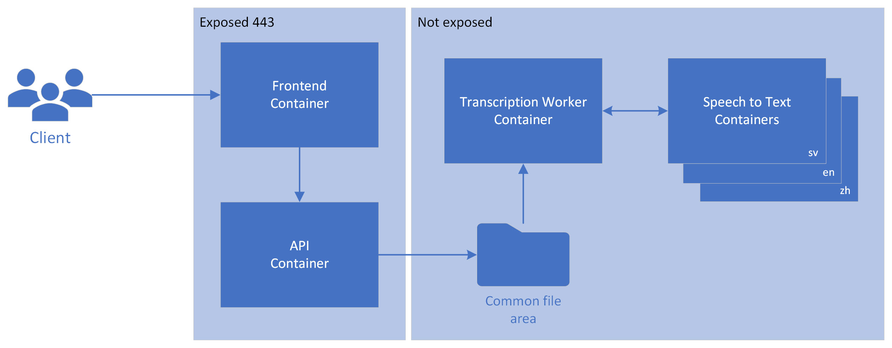

# Introduction
This document aims to describe the infrastructure design for the Transcribe system regardless of the platform it's running on. This design could be used to deploy the system using docker, Kubernetes cluster, docker swarm, docker compose, open shift or any other tool that can deploy containers.

# Purpose

# High level design

# Architecture

## System overview
There are in total 4** containers that needs to be deployed for the system to work. 
Read more about the containers in the [Container Design](#container-design) section.

\** When support for more languages are added, additional containers will be added.

### Infrastructure Recommendations
1. Hardware recommendations
   * CPU: Minimum of 4 cores for the Speech to Text container, with a recommendation of 8 cores for optimal performance. Each core should be at least 2.6 GHz or faster.
   * Memory: A minimum of 4 GB RAM for the Speech to Text container, with a recommended 8 GB. Additional memory may be required depending on the size and number of concurrent transcriptions.
   * Storage: Adequate disk space for storing audio files and transcriptions. This should include high-speed SSD storage for optimal performance, with a minimum of 50 GB available space.
2. Network recommendations
   * Bandwidth: Sufficient bandwidth to handle the upload of audio files and the download of transcriptions. A minimum of 100 Mbps is recommended.
   * Security: Secure network configurations, including firewalls and encrypted data transfer protocols, to protect sensitive audio data during transmission.
   * Allowance: Allowance for 
3. Virtual Resources
   * Virtual Machines (VMs): If deploying on a cloud platform, ensure VMs meet the CPU and memory recommendations.
   * Container Orchestration: If using Kubernetes or Docker Swarm, ensure the orchestration system can handle the deployment and management of the containerized services.
4. Software and Operating System
   * Docker Engine: The latest stable release of Docker for container management.
5. Backup and Disaster Recovery
   * Backup: A backup solution to protect the log-files in case of data loss.
     * Sensitive data, such as audio files and transcriptions, should __not__ be backed up. This solution is build on the premise that the audio files and transcriptions can be deleted after a successful transcription.
   * A disaster recovery plan to ensure quick restoration of services in case of system failures or data loss.
6. Compliance and Security recommendations
   * Ensure that the infrastructure meets any compliance and security standards required by your organization.
   * Since the audio files and transcriptions might contain sensitive data, ensure that the infrastructure, including backups of the filesystem, meets any compliance and security standards required by your organization.
7. Monitoring and Maintenance
   * Monitoring tools to track system performance, resource usage, and potential issues in real-time.
   * Regular maintenance schedule for system updates, security patches, and performance optimizations.

*\*\* Some recommendations are only valid when running the system directly on the host machine using docker or docker-compose.*

### Routing Recommendations
These recommendations are designed to ensure that the Transcribe system's containers are accessible as needed while maintaining strict security controls.  
The accessible containers (Frontend and API) are exposed for necessary user interactions, while the other components are shielded from direct user access, safeguarding the system's integrity and security.

#### Exposed Containers
1. **Frontend Container:**
   - Accessibility: Should be publicly accessible to end-users.
   - Purpose: Allows end-users to upload audio files and view transcription results.

2. **API Container:**
   - Accessibility: Requires the same level of public accessibility as the frontend, as it communicates directly with the frontend.
   - Necessary Access: Requires access to the common file area for operational purposes.

#### Restricted Access Containers and Common File Area
1. **Common File Area:**
   - Accessibility: Should not be publicly accessible or accessible by end-users.
   - Purpose: Stores audio files and transcriptions, requiring controlled access for security.

2. **FolderWatcher:**
   - Accessibility: Should not be accessible by end-users for security reasons.
   - Necessary Access:
     - Requires access to the common file area to retrieve and process audio files.
     - Needs connectivity to the Speech to Text container for transcription processing.
   - Regularily update and verify spx container version here: https://hub.docker.com/r/msftspeech/spx/tags

3. **Speech to Text Containers:**
   - Accessibility: Should not be directly accessible from the internet to maintain security.
   - Internet Access:
     - Requires limited internet access for reporting billing information to Azure, following strict security protocols. The billing url used, is defined in the relevant docker-compose.yml-file.
   - Regularily update and verify speech container version here: https://mcr.microsoft.com/product/azure-cognitive-services/speechservices/speech-to-text/tags

### Container Design
This section contains information about the containers that make up the Transcribe system. It includes details about the container's purpose, location, dependencies, and other relevant information. For more information how to deploy the containers, please follow the Location link for each container.

#### Frontend
- **Description:** This is the user interface where users can upload audio files and view transcription results. 
- **Location:** [Frontend Repository](../../reactapp/)
- **Docker Image:** Custom image built from this [Dockerfile](../../reactapp/Dockerfile).
- **Port:** Exposed on public port `443`.
- **Dependencies:** ??

#### API
- **Description:** Manages requests from the frontend and interfaces with other components. It plays a pivotal role in the data flow within the system.
- **Location:** [API Repository](../../api/)
- **Docker Image:** Custom image constructed from this [Dockerfile](../../api/Dockerfile).
- **Port:** Exposed on public port `443`.
- **Dependencies:** 
  - Requires access to a common file area for storing audio files and transcriptions. Same file area that is used by the Folder Watcher.

#### Folder Watcher
- **Description:** A backend service that handles the transcription queue and processing logic.
- **Location:** [Folder Watcher Repository](../../FolderWatcher/)
- **Docker Image:** Built using the [Dockerfile](../../FolderWatcher/Dockerfile).
- **Port:** Not applicable (internal use only).
- **Dependencies:** 
  - Requires access to a common file area for storing audio files and transcriptions. Same file area that is used by the API.
  - Requires connectivity to Speech to Text containers for transcription processing.

#### Speech to Text Containers
- **Description:** Converts audio to text using Microsoft's Azure AI services. It's a core component for transcription functionality. Each container is build to handle a specific language.
- **Location:** Externally developed container.
- **Docker Image:** 
  - Azure AI services Speech To Text, available [here](https://hub.docker.com/_/microsoft-azure-cognitive-services-speechservices-speech-to-text?tab=description).
  - Used together with a suffix to set the language: `<major>.<minor>.<patch>-<platform>-<locale>-<prerelease>`
    - Example: `mcr.microsoft.com/azure-cognitive-services/speechservices/speech-to-text:4.3.0-amd64-sv-se`
  - Please view the main [README.md](../../README.md) for more information about available languages.
- **Port:** Internal use on port `5000`.
- **Dependencies:** Internet access for connecting and reporting billing information.

#### References
* [Azure AI services Speech To Text](https://hub.docker.com/_/microsoft-azure-cognitive-services-speechservices-speech-to-text)
* [Speech containers overview](https://learn.microsoft.com/en-us/azure/ai-services/speech-service/speech-container-overview)
* [Speech to text containers with Docker](https://learn.microsoft.com/en-us/azure/ai-services/speech-service/speech-container-stt?tabs=container&pivots=programming-language-csharp)

#### Hardware Requirements
| Container | Minimum | Recommended | Speech Model |
| --- | --- | --- | --- |
| Speech to text | 4 core, 4-GB memory | 8 core, 8-GB memory | +4 to 8 GB memory |

Quote:
> Each core must be at least 2.6 gigahertz (GHz) or faster.  
> Core and memory correspond to the --cpus and --memory settings, which are used as part of the docker run command.

